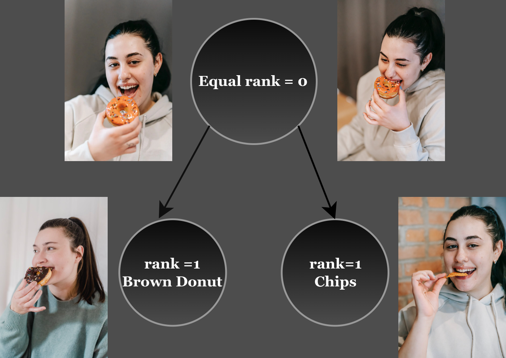

# T2IScoreScore( TS2): Objectively assessing text-to-image prompt faithfulness metrics


We introduced **T2IScoreScore** dataset! 📸✨  🤗 [HF Repo](https://huggingface.co/datasets/saxon/T2IScoreScore)

This repository contains the code and models for our paper:

[Who Evaluates the Evaluations? Objectively Scoring Text-to-Image Prompt Coherence Metrics with T2IScoreScore (TS2)](https://arxiv.org/abs/2404.04251) Please check the [project page](https://t2iscorescore.github.io/) for a quick overview.

T2IScoreScore is a meticulously curated dataset featuring image sets that smoothly transition from high to low faithfulness with respect to the given prompt. This collection includes both synthetic and natural examples, providing a comprehensive range for meta-evaluating existing Text-to-Image (T2I) metrics. Our goal is to facilitate the development of more accurate and consistent T2I metrics in the future.

⚡ There is a sample of an error graph for the initial prompt “**A
happy young woman eating a tasty orange donut**” using natural
images.
 There are **two** different nodes of error distance 1 from the
head node of the graph:

<div style="text-align:center;">
    
</div>

## Question Generation

1. Run the DSG Recipe for Question Generation

    Execute the following command to generate questions using the Tifa model:

    ```bash
    git clone git@github.com:j-min/DSG.git
    cd DSG
    python T2IScoreScore/src/question_generator/dsg_question_generator.py
           --api_key 'openai_api_key'
           --input_file 'src/question_generator/TS2_prompts.txt'
           --output_csv 'src/question_generator/T2S_DSG_Q_dependency.csv'
    ```

2. Run the Tifa Recipe for Question Generation

    Execute the following command to generate questions using the Tifa model:

    ```bash
    python T2IScoreScore/src/question_generator/tifa_question_generator.py
           --api_key 'openai_api_key'
           --input_file 'src/question_generator/TS2_prompts.txt'
           --output_csv 'src/question_generator/TS2_TIFA_Q.csv'
    ```

Replace the placeholders with appropriate values:

 `-a`, `--api_key`: Your OpenAI API key.
 `-i`, `--input_file`: Path to the input file containing prompts.
 `-o`, `--output_csv`: Path to save the output CSV file.

Make sure to provide the correct paths and API key. Feel free to adjust the command for your specific needs.

## Evaluated Metrics on This Dataset

### Similarity Score

- **ClipScore**
- **BlipScore**
- **AlignScore**

Usage

Command Line Arguments

  `-m`, `--model`: Choose sim score model (clip, blip, align).
  `-o`, `--output`: Path to the output CSV file.
  `-i`, `--image_folder`: Base path for image files.
  `-md`, `--metadata_file`: Path to the meta-data CSV file.

Example:

 ```bash
python simscore.py --model 'clip' -image_folder 'data/T2IScoreScore/' -md 'data/metadata.csv' -o 'output/clipscore.csv'
```

## Custom SimScorer Implementation

If you want to create your own similarity scorer, you can implement a class that extends the `SimScorer` abstract class.
Use the template provided below:

```python
from abc import ABC, abstractmethod

class CustomSimScorer(SimScorer):
    """
    Custom Similarity Scorer implementation.

    This class inherits from SimScorer and provides a template for implementing a custom similarity scoring method.

    """
    @abstractmethod
    def calculate_score(self, image, prompt):
        """
        Calculate a similarity score between an image and a prompt using the custom scoring method.

        #### Parameters
        - `image` (str): The image file name for scoring. Example: "1-0.jpg".
        - `prompt` (str): The prompt data for scoring.

        #### Returns
        - `float`: The calculated similarity score.
        """
        pass
```

Example usage of your custom SimScorer,

```python
custom_scorer = MyCustomScorer()
question = 'What is in the image?'
image_path = 'path/to/your/image.jpg'
answer = custom_scorer.get_answer(question, image_path)
print(f'Generated answer: {answer}')
```

### VQA Score

- **LLaVa**
- **Fuyu**
- **mPLUG**
- **instructBlip**
- **Blip1**

Usage

1- PostProcess of raw answers

Command Line Arguments

‍‍`-m`, `--model`: Choose the VQA model (mplug, fuyu, llava, instructBlip, blip).
`-q`, `--questions_file`: Path to the questions CSV file (tifa, dsg).
`-o`, `--output`: Path to the output CSV file.
`-i`, `--image_folder`: Base path for image files.
`-s`, `--start`: Start index for image processing.
`-e`, `--end`: End index for image processing.
`-md`, `--metadata_file`: Path to meta-data CSV file.


Example:

```bash
python run_vqascor.py --model 'mplug' --questions_file 'data/TS2_TIFA_Q.csv' --output 'output/mplug_tifa.csv' --image_folder 'data/T2IScoreScore/' --start '0' --end ':' --metadata_file 'data/metadata.csv'
```

2- PostProcess of raw answers

Command Line Arguments

 `-s`, `--score_file`: Output CSV file for scores (required).
 `-q`, `--question_file`: Question CSV file (required).
 `-m`, `--question_gen_method`: Question generation method (tifa, dsg) [default: dsg] (required).
 `-r`, `--raw_answer_file`: Input CSV file for raw answers (required).

Example:

```bash
python postprocess.py --score_file 'output/scores.csv' --question_file 'data/T2S_DSG_Q_dependency.csv' --question_gen_method 'dsg' --raw_answer_file 'output/raw_answers.csv'
```

### Custom VQAScorer Implementation

If you want to test your own VQAScorer, you can create a class that extends the `VQAScorer` abstract class.
Use the template provided below:

```python
from abc import ABC, abstractmethod

class MyCustomScorer(VQAScorer):
    def __init__(self):
        '""
        Initialize your custom VQA scorer.
        """
        # Your initialization code here

    @abstractmethod
    def get_answer(self, question, image_path):
        """
        Generate an answer for a given question and image.

        Args:
            question (str): The question to be answered.
            image_path (str): Path to the image associated with the question.

        Returns:
            str: The generated answer to the question.
        """
        # Your custom scoring logic here
        pass
```

Example usage of your custom VQAScorer

```python
custom_scorer = MyCustomScorer()
question = 'What is in the image?'
image_path = 'path/to/your/image.jpg'
answer = custom_scorer.get_answer(question, image_path)
print(f'Generated answer: {answer}')
```


### LLM based Score

- **LLMScore**

 Usage

 Command Line Arguments

`--image_folder`: Base path for image files.
`--metadata_file`: Path to meta-data CSV file.

Example:

```bash
python llm_score.py --image_folder 'data/T2IScoreScore/' --metadata_file 'data/metadata.csv'
```
